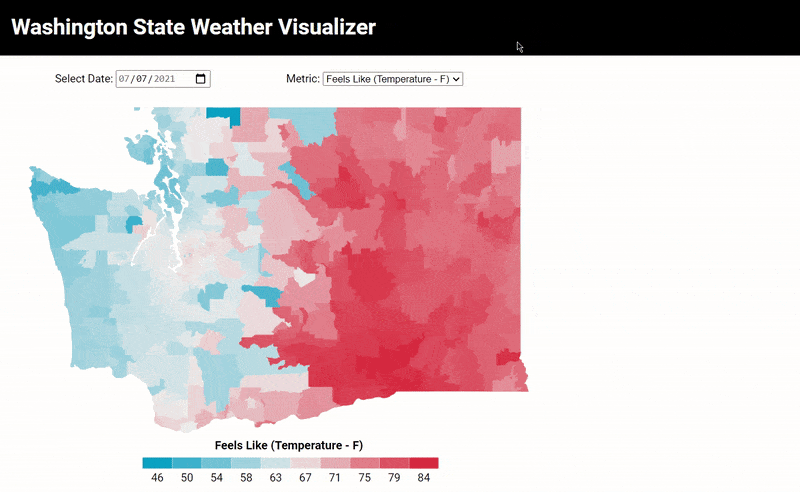

<kbd></kbd>

### Description
  
Analyze the weather for the following eight days by reviewing the following categories:

  <ul>
      <li><b>Feels Like (Temperature - F)</b> - The “feels like” averaged between the morning, day, evening and night temperature.</li>
      <li><b>Chance of Precipitation (%)</b> - The percent chance of precipitation (includes rain & snow).</li>
      <li><b>Cloud Cover (%)</b> - The percent of the sky that will be covered with clouds.</li>
      <li><b>Wind Speeds (mph)</b> - The average projected wind speeds.</li>
  </ul>

### Purpose
  
The motivation behind this tool was the lack of a weather filter on <a href="https://www.alltrails.com/">All Trails</a>. Before having this, the only way I could find which hikes had good weather was to manually check the forecast on many zip codes until I found something suitable.

### Data Origin
  
The weather data comes from <a href="https://openweathermap.org/">OpenWeather</a>.

### Tech Stack
  <li><b>Python</b> - Data generation from OpenWeather API</li>
  <li><b>D3/JavaScript</b> - Interactive visualization</li>
  <li><b>HTML</b> - Website structure</li>
  <li><b>CSS</b> - Tool styling</li>
